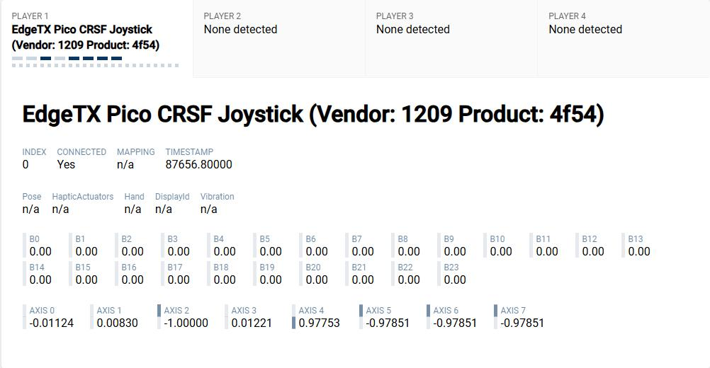

# ELRSJoystick / CRSFJoystick

<https://github.com/mikeneiderhauser/CRSFJoystick>

Named CRSFJoystick as it indicates the wire protocol between the microcontroller (pi pico) and receiver).

Arduino code using the mbed core that runs on a Pi Pico (2040) to emulate a USB HID Joystick

Pirmarily developed to use and ExpressLRS receiver and a HID Joystick for Sim use! It will work with both Tracer and Crossfire as well.

Shout out to CapnBry for the Crsf Library

https://github.com/CapnBry/CRServoF

Shout out to RealRobots.net for the Gamepad Library

https://gitlab.com/realrobots/PicoGamepad/-/tree/master

# PS4 Liftoff mode

https://www.liftoff-game.com/news/transmitter-support-available-ps4

Liftoff on PS4 supports only a small list of [devices](https://www.liftoff-game.com/support?topic=70&category=1&post=181), that's why we need to emulate the operation of one of them fully.

OpenTX src:
- [usbd_desc](https://github.com/opentx/opentx/blob/2.3/radio/src/targets/common/arm/stm32/usbd_desc.c)
- [usbd_hid_joystick](https://github.com/opentx/opentx/blob/2.3/radio/src/targets/common/arm/stm32/usbd_hid_joystick.c)

[EdgeTX Joystick Mapping Information](https://manual.edgetx.org/edgetx-how-to/joystick-mapping-information-for-game-developers).
[Thread](https://github.com/EdgeTX/edgetx/issues/4580) helped to debug.

ArduinoCore-mbed has the values [hardcoded](https://github.com/arduino/ArduinoCore-mbed/blob/a7f93afae63feb5638fcd44da30e333ca06a3d39/variants/RASPBERRY_PI_PICO/pins_arduino.h#L65-L67) without respect for changeability at pins_arduino.h.

___
pins_arduino.h location:

`C:\Users\<user>\.platformio\packages\framework-arduino-mbed\variants\RASPBERRY_PI_PICO\pins_arduino.h`

Custom definitions:
```
#define BOARD_VENDORID		0x1209
#define BOARD_PRODUCTID		0x4f54
#define BOARD_NAME			"EdgeTX Pico CRSF Joystick"
```


